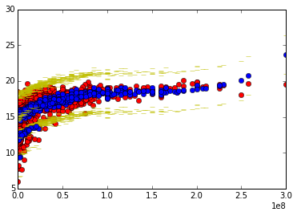

##Movie Data Check-in Submission

I used a log-linear regression model with several features:

Budget
Budget^2
Budget^3
Runtime
Release Month
Rating (as dummy features)
Genre (as dummy features)

To attempt to predict Total Domestic Box Office gross.  

In this first figure, the results of the model (predicted log(Gross)) [in blue] are plotted against the actual (log(Gross)) [in red] for the testing set.

The yellow dashed represent the upper and lower bounds of a 95% confidence interval.
